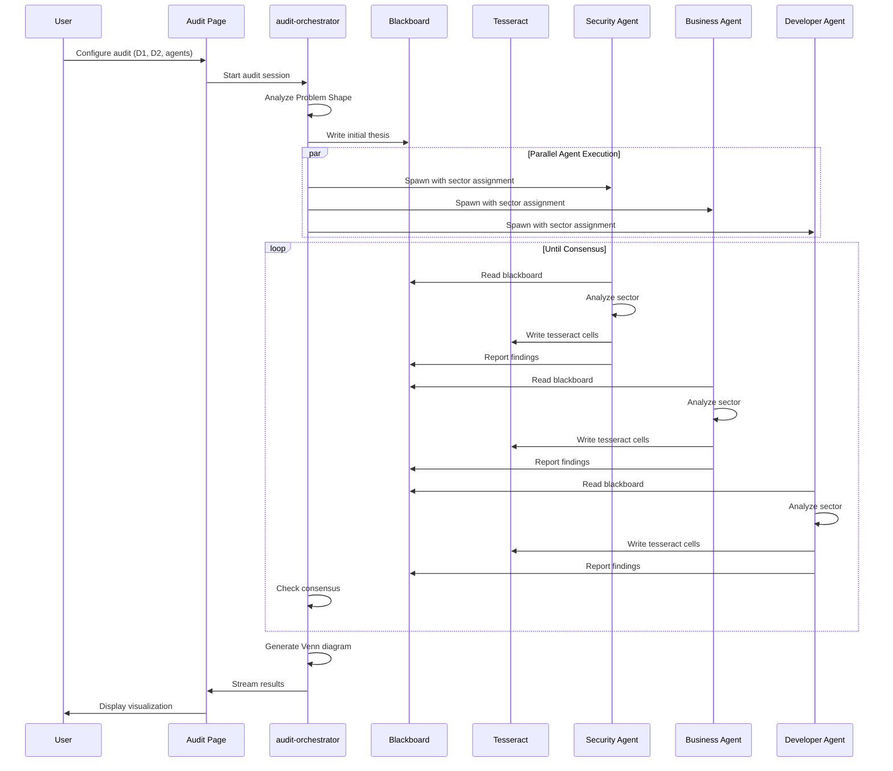
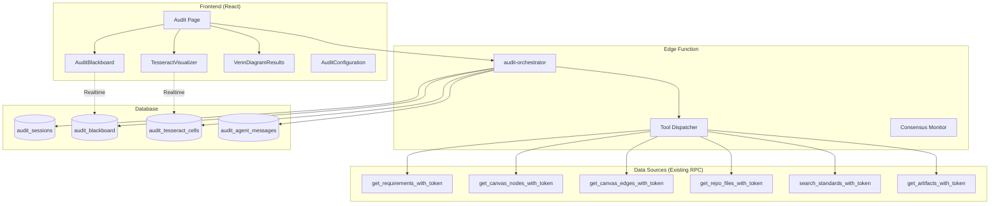

# Pronghorn.RED Multi-Agent Audit System

> **Feature Blackboard** — Living documentation for the Audit feature implementation
> 
> **Status**: 🚧 Phase 1 - Foundation  
> **Last Updated**: 2025-12-25  
> **Version**: 0.1.0

---

## Table of Contents

1. [Vision & Theory](#vision--theory)
2. [Architecture Overview](#architecture-overview)
3. [Data Structures](#data-structures)
4. [Tool Inventory](#tool-inventory)
5. [Agent System](#agent-system)
6. [Visualization Components](#visualization-components)
7. [Database Schema](#database-schema)
8. [Implementation Progress](#implementation-progress)
9. [Known Challenges](#known-challenges)

---

## Vision & Theory

### Core Concept

The Audit system enables **cognitive cross-comparison** between project datasets using a swarm of specialized AI agents. Unlike traditional auditing tools that compare line-by-line, this system builds a **semantic understanding** of alignment between two datasets.

### The Venn Diagram Output

Every audit produces a three-column result:

```
┌─────────────────┬─────────────────────┬─────────────────────┐
│  UNIQUE TO D1   │      ALIGNED        │   UNIQUE TO D2      │
│                 │                     │   (Challenges)      │
├─────────────────┼─────────────────────┼─────────────────────┤
│ Requirements    │ Requirement R1.2    │ Canvas node "API    │
│ without code    │ fully implemented   │ Gateway" has no     │
│ coverage        │ in canvas design    │ requirement source  │
└─────────────────┴─────────────────────┴─────────────────────┘
```

### Example Use Cases

| Dataset 1 | Dataset 2 | Question Answered |
|-----------|-----------|-------------------|
| Requirements | Canvas | Are all requirements represented in the architecture? |
| Canvas | Repository | Is the architecture fully implemented in code? |
| Standards | Repository | Does the code comply with all standards? |
| Requirements | Standards | Are all requirements covered by applicable standards? |

### The Tesseract Metaphor

Agents populate a **3D evidence grid** called the Tesseract:

- **X-axis**: Elements from Dataset 1 (e.g., 100 requirements)
- **Y-axis**: Evidence steps/iterations (e.g., 50 analysis passes)
- **Z-axis**: Polarity scores (-1 = gap, 0 = unknown, +1 = alignment)

```
        Z (Polarity)
        │
        │   ┌───────────────────────┐
        │  /│                      /│
        │ / │                     / │
        │/  │                    /  │
    +1 ─┼───┼───────────────────┼───┤
        │   │                   │   │
        │   │   TESSERACT       │   │
        │   │   EVIDENCE GRID   │   │
    0  ─┼───┼───────────────────┼───┤
        │   │                   │   │
        │   │                   │   │
        │   │                   │   │
   -1  ─┼───┼───────────────────┼───┤────────── Y (Evidence Steps)
        │  /                    │  /
        │ /                     │ /
        │/                      │/
        └───────────────────────┘
        │
        └──────────────────────────────────── X (Dataset 1 Elements)
```

---

## Architecture Overview

### System Flow



### Component Architecture



---

## Data Structures

### Problem Shape

Before agents begin, the orchestrator builds a cognitive map:

```typescript
interface ProblemShape {
  sessionId: string;
  
  dataset1: {
    type: 'requirements' | 'canvas' | 'repository' | 'standards' | 'artifacts';
    totalElements: number;
    selectedIds: string[] | null;  // null = all elements
    hierarchy: HierarchyNode[];
    keyTerms: string[];  // Extracted for semantic matching
    structure: 'flat' | 'tree' | 'graph';
    summary: string;  // LLM-generated summary
  };
  
  dataset2: {
    type: 'requirements' | 'canvas' | 'repository' | 'standards' | 'artifacts';
    totalElements: number;
    selectedIds: string[] | null;
    hierarchy: HierarchyNode[];
    keyTerms: string[];
    structure: 'flat' | 'tree' | 'graph';
    summary: string;
  };
  
  estimatedComplexity: number;  // 1-10
  recommendedIterations: number;
  sectorAssignments: SectorAssignment[];
}

interface HierarchyNode {
  id: string;
  label: string;
  type: string;
  parentId: string | null;
  depth: number;
  childCount: number;
}

interface SectorAssignment {
  agentRole: string;
  elementRange: { start: number; end: number };
  focus: string;
}
```

### Tesseract Cell

```typescript
interface TesseractCell {
  id: string;
  sessionId: string;
  
  // X-axis: Dataset 1 element
  xElementId: string;
  xElementType: string;
  xElementLabel: string;
  xIndex: number;
  
  // Y-axis: Evidence step
  yStep: number;
  yStepLabel: string;
  
  // Z-axis: Polarity
  zPolarity: number;  // -1 to +1
  zCriticality: 'critical' | 'major' | 'minor' | 'info';
  
  // Evidence
  evidenceSummary: string;
  evidenceRefs: EvidenceRef[];
  
  // Attribution
  contributingAgents: string[];
  
  createdAt: string;
  updatedAt: string;
}

interface EvidenceRef {
  type: 'requirement' | 'canvas_node' | 'canvas_edge' | 'file' | 'standard' | 'artifact';
  id: string;
  excerpt: string;
  relevance: number;  // 0-1
}
```

### Blackboard Entry

```typescript
interface BlackboardEntry {
  id: string;
  sessionId: string;
  iteration: number;
  agentRole: string;
  entryType: 'thesis' | 'action' | 'finding' | 'reflection' | 'consensus' | 'request';
  content: string;
  evidence: EvidenceRef[];
  confidence: number;  // 0-1
  targetAgent?: string;  // For 'request' type
  createdAt: string;
}
```

### Venn Result

```typescript
interface VennResult {
  sessionId: string;
  generatedAt: string;
  
  uniqueToDataset1: VennItem[];
  aligned: VennItem[];
  uniqueToDataset2: VennItem[];
  
  summary: {
    dataset1Coverage: number;  // Percentage with alignment
    dataset2Coverage: number;
    criticalGaps: number;
    majorGaps: number;
    minorGaps: number;
  };
}

interface VennItem {
  id: string;
  sourceDataset: 1 | 2;
  elementId: string;
  elementType: string;
  elementLabel: string;
  evidence: EvidenceRef[];
  criticality: 'critical' | 'major' | 'minor' | 'info';
  agentNotes: string;
  confidence: number;
}
```

---

## Tool Inventory

### Data Source Tools (READ - Viewer Role)

These tools **REUSE EXISTING RPC FUNCTIONS** - no new implementations needed.

| Tool | Existing RPC | Purpose |
|------|--------------|---------|
| `get_problem_shape` | NEW | Build cognitive map of both datasets |
| `read_dataset_1_element` | Multiple* | Read specific element from D1 |
| `read_dataset_2_element` | Multiple* | Read specific element from D2 |
| `search_dataset_1` | Multiple* | Keyword search within D1 |
| `search_dataset_2` | Multiple* | Keyword search within D2 |
| `get_dataset_1_summary` | Multiple* | Get hierarchical overview of D1 |
| `get_dataset_2_summary` | Multiple* | Get hierarchical overview of D2 |

*Routes to existing RPC based on dataset type:
- Requirements: `get_requirements_with_token`, `search_requirements_with_token`
- Canvas: `get_canvas_nodes_with_token`, `get_canvas_edges_with_token`, `get_canvas_summary_with_token`
- Repository: `get_repo_files_with_token`, `search_file_content_with_token`
- Standards: `search_standards_with_token`, `get_project_standards_detail_with_token`
- Artifacts: `get_artifacts_with_token`

### Shared Memory Tools (WRITE - Editor Role)

| Tool | RPC Function | Purpose |
|------|--------------|---------|
| `read_blackboard` | `get_audit_blackboard_with_token` | Read all blackboard entries |
| `write_blackboard` | `insert_audit_blackboard_with_token` | Add entry to blackboard |
| `read_tesseract` | `get_audit_tesseract_cells_with_token` | Read current tesseract state |
| `write_tesseract_cell` | `upsert_audit_tesseract_cell_with_token` | Add/update evidence cell |
| `get_audit_progress` | `get_audit_session_with_token` | Get current session state |

### Collaboration Tools (WRITE - Editor Role)

| Tool | RPC Function | Purpose |
|------|--------------|---------|
| `request_agent_assistance` | `insert_audit_blackboard_with_token` | Ask another agent for help |
| `propose_thesis` | `insert_audit_blackboard_with_token` | Propose theory for validation |
| `vote_on_consensus` | `update_audit_session_consensus_with_token` | Vote that analysis is complete |
| `signal_sector_complete` | `update_audit_agent_sector_with_token` | Mark assigned sector as done |

### Session Management Tools (OWNER Role - Orchestrator Only)

| Tool | RPC Function | Purpose |
|------|--------------|---------|
| `spawn_agent` | `insert_audit_agent_instance_with_token` | Create new agent instance |
| `terminate_agent` | `update_audit_agent_status_with_token` | Stop an agent |
| `check_consensus` | `get_audit_consensus_state_with_token` | Check if all agents agree |
| `finalize_venn_diagram` | `update_audit_session_venn_with_token` | Generate and store final result |

---

## Agent System

### Default Agent Personas

```json
{
  "agents": [
    {
      "role": "security_analyst",
      "name": "Security Analyst",
      "emoji": "🔒",
      "color": "#ef4444",
      "focus": "Vulnerabilities, access control, data exposure, security gaps",
      "systemPrompt": "You are a cybersecurity expert analyzing project artifacts..."
    },
    {
      "role": "business_analyst", 
      "name": "Business Analyst",
      "emoji": "📊",
      "color": "#3b82f6",
      "focus": "Requirements fulfillment, business logic, user stories",
      "systemPrompt": "You are a business analyst ensuring requirements are met..."
    },
    {
      "role": "developer",
      "name": "Developer",
      "emoji": "💻",
      "color": "#10b981",
      "focus": "Code quality, implementation completeness, technical debt",
      "systemPrompt": "You are a senior developer reviewing implementation..."
    },
    {
      "role": "end_user",
      "name": "End User",
      "emoji": "👤",
      "color": "#8b5cf6",
      "focus": "User experience, usability, accessibility, user stories",
      "systemPrompt": "You represent the end user perspective..."
    },
    {
      "role": "architect",
      "name": "Architect",
      "emoji": "🏗️",
      "color": "#f59e0b",
      "focus": "System design, integration, patterns, scalability",
      "systemPrompt": "You are a system architect evaluating design..."
    }
  ]
}
```

### Agent Coordination Protocol

1. **Sector Assignment**: Orchestrator divides Dataset 1 elements among agents
2. **Blackboard is Truth**: Agents ONLY trust what's on the blackboard
3. **Evidence Required**: All findings must cite specific element IDs
4. **Consensus Voting**: Agents vote when they believe analysis is complete
5. **Assistance Requests**: Agents can ask others for domain expertise

### Agent Iteration Loop

```
FOR each iteration:
  1. READ blackboard (filter: last 50 entries for context window management)
  2. READ tesseract summary (aggregate, not individual cells)
  3. ANALYZE assigned sector elements
  4. WRITE findings to tesseract cells
  5. WRITE summary to blackboard
  6. CHECK if sector complete
  7. VOTE on consensus if all sectors done
```

---

## Visualization Components

### TesseractVisualizer

**2D Heatmap Mode** (Default):
- X-axis: Dataset 1 elements
- Y-axis: Evidence steps
- Color: Polarity gradient (red → yellow → green)
- Opacity: Confidence level
- Click: Expand cell details

**3D Mode** (Optional):
- WebGL rendering of full tesseract
- Rotatable/zoomable
- Slice selection

### AuditBlackboard

- Chronological feed of agent communications
- Agent avatar with role color
- Entry type badges (thesis, action, finding, etc.)
- Expandable evidence links
- Filter by agent, entry type
- Real-time streaming

### VennDiagramResults

- Three-column layout
- Collapsible item groups by criticality
- Evidence preview on hover
- Export options (JSON, CSV, PDF)
- Summary statistics

---

## Database Schema

### New Tables

```sql
-- Audit sessions
CREATE TABLE audit_sessions (
  id UUID PRIMARY KEY DEFAULT gen_random_uuid(),
  project_id UUID NOT NULL REFERENCES projects(id) ON DELETE CASCADE,
  name TEXT NOT NULL,
  description TEXT,
  status TEXT DEFAULT 'pending',
  
  -- Dataset configuration
  dataset_1_type TEXT NOT NULL,
  dataset_1_ids UUID[],
  dataset_2_type TEXT NOT NULL,
  dataset_2_ids UUID[],
  
  -- Agent configuration
  agent_definitions JSONB,
  max_iterations INTEGER DEFAULT 500,
  current_iteration INTEGER DEFAULT 0,
  
  -- Results
  problem_shape JSONB,
  tesseract_dimensions JSONB,
  venn_result JSONB,
  
  -- Consensus tracking
  consensus_votes JSONB DEFAULT '{}',
  consensus_reached BOOLEAN DEFAULT FALSE,
  
  created_at TIMESTAMPTZ DEFAULT now(),
  completed_at TIMESTAMPTZ,
  created_by UUID REFERENCES auth.users(id)
);

-- Blackboard entries
CREATE TABLE audit_blackboard (
  id UUID PRIMARY KEY DEFAULT gen_random_uuid(),
  session_id UUID NOT NULL REFERENCES audit_sessions(id) ON DELETE CASCADE,
  iteration INTEGER NOT NULL,
  agent_role TEXT NOT NULL,
  entry_type TEXT NOT NULL,
  content TEXT NOT NULL,
  evidence JSONB DEFAULT '[]',
  confidence FLOAT,
  target_agent TEXT,
  created_at TIMESTAMPTZ DEFAULT now()
);

-- Tesseract cells
CREATE TABLE audit_tesseract_cells (
  id UUID PRIMARY KEY DEFAULT gen_random_uuid(),
  session_id UUID NOT NULL REFERENCES audit_sessions(id) ON DELETE CASCADE,
  
  x_element_id UUID NOT NULL,
  x_element_type TEXT NOT NULL,
  x_element_label TEXT,
  x_index INTEGER NOT NULL,
  
  y_step INTEGER NOT NULL,
  y_step_label TEXT,
  
  z_polarity FLOAT NOT NULL DEFAULT 0,
  z_criticality TEXT DEFAULT 'info',
  
  evidence_summary TEXT,
  evidence_refs JSONB DEFAULT '[]',
  contributing_agents TEXT[],
  
  created_at TIMESTAMPTZ DEFAULT now(),
  updated_at TIMESTAMPTZ DEFAULT now(),
  
  UNIQUE(session_id, x_element_id, y_step)
);

-- Agent instances per session
CREATE TABLE audit_agent_instances (
  id UUID PRIMARY KEY DEFAULT gen_random_uuid(),
  session_id UUID NOT NULL REFERENCES audit_sessions(id) ON DELETE CASCADE,
  agent_role TEXT NOT NULL,
  agent_name TEXT NOT NULL,
  system_prompt TEXT NOT NULL,
  sector_start INTEGER,
  sector_end INTEGER,
  status TEXT DEFAULT 'active',
  sector_complete BOOLEAN DEFAULT FALSE,
  consensus_vote BOOLEAN,
  created_at TIMESTAMPTZ DEFAULT now(),
  completed_at TIMESTAMPTZ
);
```

### RPC Functions Needed (NEW)

All follow `_with_token` pattern with `require_role(p_project_id, p_token, 'editor')`:

| Function | Purpose |
|----------|---------|
| `insert_audit_session_with_token` | Create new audit session |
| `get_audit_session_with_token` | Get session details |
| `update_audit_session_with_token` | Update session state |
| `get_audit_blackboard_with_token` | Get blackboard entries |
| `insert_audit_blackboard_with_token` | Add blackboard entry |
| `get_audit_tesseract_cells_with_token` | Get tesseract cells |
| `upsert_audit_tesseract_cell_with_token` | Add/update cell |
| `get_audit_tesseract_summary_with_token` | Get aggregated view |
| `insert_audit_agent_instance_with_token` | Spawn agent |
| `update_audit_agent_status_with_token` | Update agent state |

---

## Implementation Progress

### Phase 1: Foundation ✅ COMPLETE

- [x] Create feature documentation (this file)
- [x] Create auditAgentInstructions.json
- [x] Create database migration (4 tables, RLS policies)
- [x] Create RPC functions (14 functions with _with_token pattern)

### Phase 2: Edge Function ✅

- [x] Create audit-orchestrator edge function
- [x] Implement problem shape analysis (buildProblemShape)
- [x] Implement agent spawning with sector division
- [x] Implement tool dispatcher with Grok/Claude/Gemini support
- [x] Implement Venn result generation (generateVennResult)

### Phase 3: Frontend Components ✅

- [x] Create useRealtimeAudit hook
- [x] Create TesseractVisualizer (2D mode)
- [x] Create AuditBlackboard
- [x] Create VennDiagramResults
- [x] Create AuditConfigurationDialog

### Phase 4: Page Integration ✅ COMPLETE

- [x] Rewrite Audit.tsx page with new components
- [x] Session selector and management
- [x] Status bar with iteration tracking
- [x] Tab-based layout (Tesseract, Blackboard, Results)
- [x] Real-time updates via useRealtimeAudit hook
- [x] Add AgentInstancesCard component for agent monitoring
- [x] Connect to audit-orchestrator edge function on "Start Audit"
- [x] Add Audit to ProjectSidebar navigation (after Deploy)
- [x] Dataset selection with item picker in configuration dialog

### Phase 5: Polish (Future)

- [ ] Add TesseractVisualizer 3D mode
- [ ] Add export options (PDF audit report)
- [ ] Add audit history view
- [ ] Performance optimization for large datasets
- [ ] Agent conversation threading

---

## Known Challenges

### Context Window Management

**Problem**: Agents quickly exhaust context windows if they read everything.

**Solution**:
- Agents receive blackboard summary (last 50 entries)
- Tesseract provided as aggregate statistics, not individual cells
- On-demand element retrieval via tools
- Sector-based assignment limits scope

### Element Explosion (N×M Problem)

**Problem**: 100 requirements × 200 canvas nodes = 20,000 comparisons

**Solution**:
- Problem shape analysis identifies clusters
- Semantic similarity pre-filtering
- Agents work on clusters, not individual pairs
- Tesseract cells represent findings, not exhaustive comparisons

### Proving Negatives

**Problem**: Hard to prove something is missing

**Solution**:
- Multiple agents must agree on gaps
- Confidence scores reflect certainty
- "No evidence found" explicitly tracked
- Minimum iteration threshold before claiming gap

### Parallel Race Conditions

**Problem**: Multiple agents writing concurrently

**Solution**:
- Blackboard is append-only (no conflicts)
- Tesseract uses UPSERT with last-write-wins
- Orchestrator manages iteration synchronization
- Realtime broadcasts after each iteration completes

### Iteration Limits

**Problem**: Complex audits may need 1000+ iterations

**Solution**:
- Background task pattern with chunked execution
- Pause/resume capability
- Progress checkpointing
- User-configurable max iterations

---

## Appendix: Existing RPC Functions to Reuse

### Requirements
- `get_requirements_with_token(p_project_id, p_token)`
- `search_requirements_with_token(p_project_id, p_search_term, p_token)`

### Canvas
- `get_canvas_nodes_with_token(p_project_id, p_token)`
- `get_canvas_edges_with_token(p_project_id, p_token)`
- `get_canvas_layers_with_token(p_project_id, p_token)`
- `get_canvas_summary_with_token(p_project_id, p_token)`

### Repository
- `get_repo_files_with_token(p_repo_id, p_token, p_path_prefix)`
- `search_file_content_with_token(p_repo_id, p_search_term, p_token)`
- `get_file_content_with_token(p_file_id, p_token)`

### Standards
- `search_standards_with_token(p_project_id, p_search_term, p_token)`
- `get_project_standards_detail_with_token(p_project_id, p_token)`

### Artifacts
- `get_artifacts_with_token(p_project_id, p_token)`

### Tech Stacks
- `get_project_tech_stacks_detail_with_token(p_project_id, p_token)`

---

*This document is the living specification for the Audit feature. Update it as implementation progresses.*
